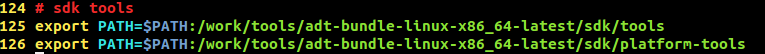

##### 目录
1. git/repo
2. 编译
3. adb调试工具
4. 源码开发常用工具

#### git/repo
* repo和git  
Git是一个开源的分布式版本控制系统，高效的进行版本管理。repo是Google用python写的一个调用git的脚本，本质是git的封装。
* 常见的git、repo命令  
```
git show # 显示某次提交的内容 git show $id
git add <file> # 将工作文件修改提交到本地暂存区
git rm <file> # 从版本库中删除文件
git reset -- . # 从暂存区恢复到工作文件
git reset --hard # 恢复最近一次提交过的状态，即放弃上次提交后的所有本次修改
git status #列出当前目录所有还没有被git管理的文件和被git管理且被修改但还未提交
git ci --amend # 修改最后一次提交记录
git diff <file> # 比较当前文件和暂存区文件差异 git diff
git commit  -m "提交的描述信息" #添加提交的描述信息
git pull # 抓取远程仓库所有分支更新并合并到本地
git push # push所有分支
git remote -v # 查看远程服务器地址和仓库名称
repo init -u $url -b $branch # 抓特定分支
repo init -u $url -b $branch --mirror # 做镜像
repo sync # 同步整个所有的项目
repo update # 上传修改的代码
```

#### 编译
- 源码编译  
整编
```
source build/envsetup.sh
lunch <product_name>-<build_variant>  // product_name：项目名;build_variant:user, userdebug, eng
make update-api // 更新/检测系统api
make //可以加参数多线程编译 -jN(N=1,2,3...)
```
单编  
```
mm // 编译当前目录
mmm xxx //编译xxx目录
```
> PS:只在有整编的基础上才能单编

#### adb调试工具
Android开发环境中的debug工具-adb（Android Debug Bridge）。
* adb的配置
Linux环境下可以将adb加到系统的环境变量中：
修改 ~/.bashrc如下：
  
执行source ~/.bashrc或重启系统生效

#### 源码开发常用工具
- Eclipse
- ADB（SDK）
- Source Insight
