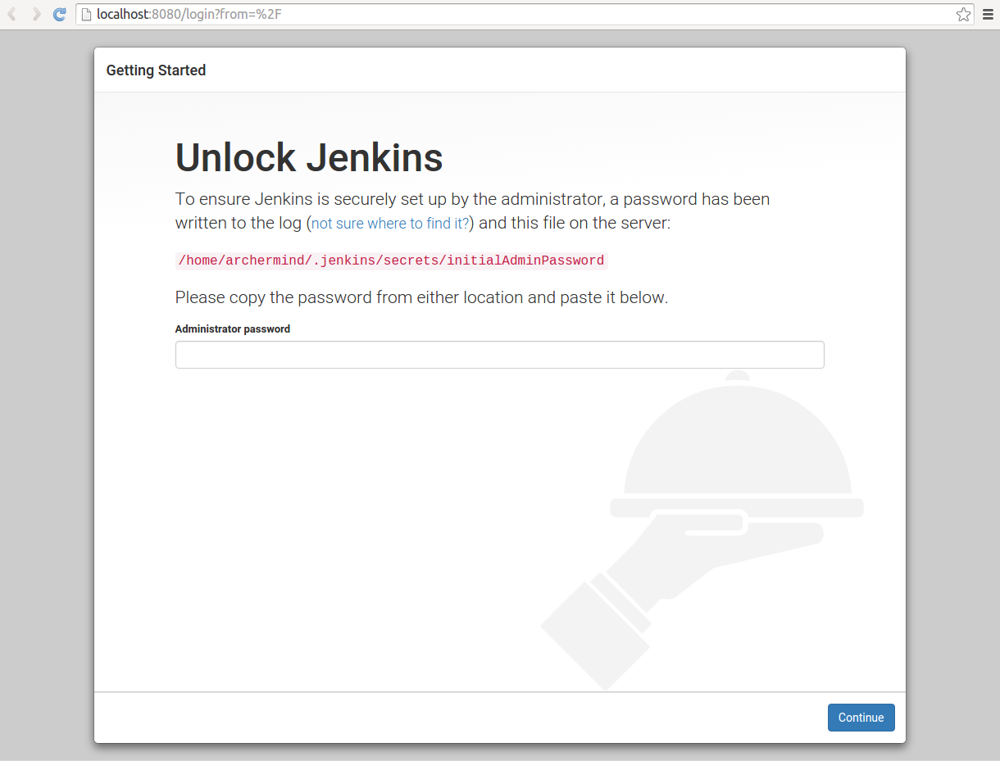
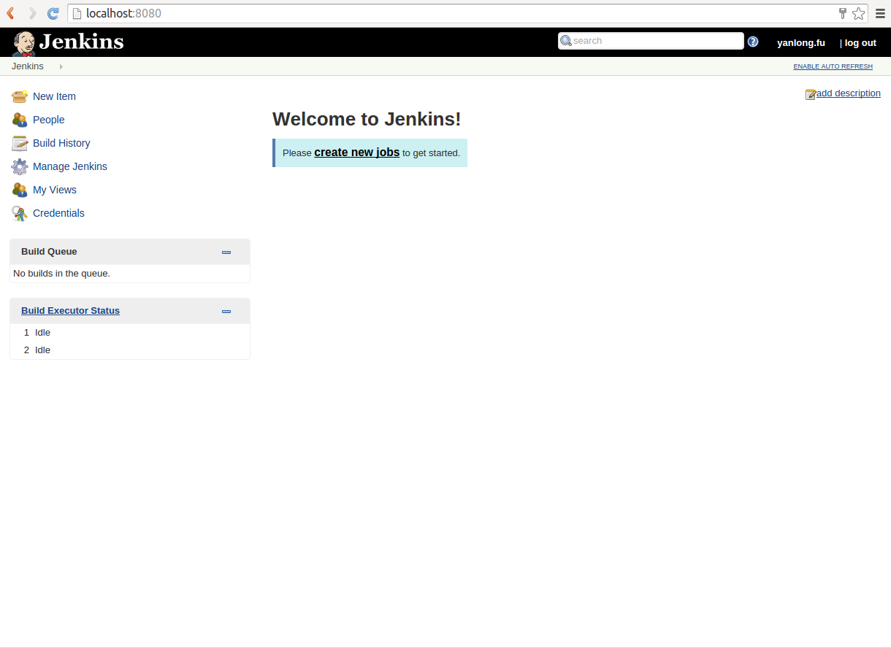
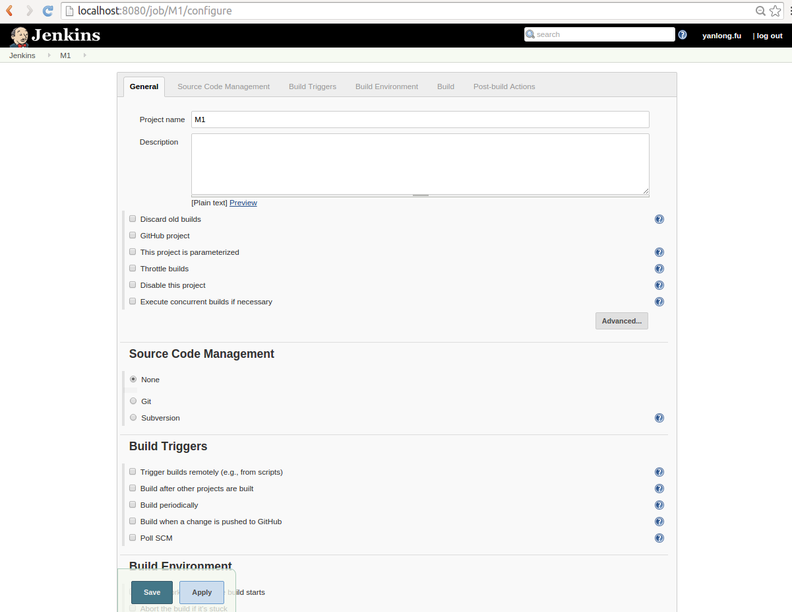
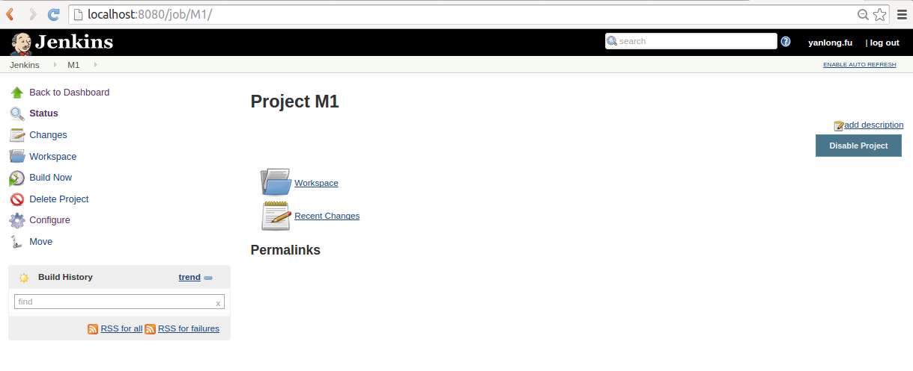

#### 目录
1. OpenGork
2. Jenkins
----
#### OpenGork
OpenGork是一个快速、便于使用的源码搜索引擎与对照引擎，能帮我们快速的搜索、定位、对照代码树。
1. 启动Tomact
```
cd Tomact/bin
./startup.sh
```
启动Tomcat服务后，在浏览器中输入网址：http://localhost:8080/ 能够进入以下页面证明Tomcat运行成功

2. 配置OpenGork
- 解压OpenGrok  
将opengrok-0.12.1/lib目录下的source.war包拷贝到apache-tomcat-7.0.40/webapps目录下，在浏览器中输入 http://localhost:8080/source/ 查看是否配置成功。

- 创建/var/opengrok/etc/目录
```
cd /var
sudo mkdir opengrok
sudo mkdir opengrok/etc
sudo chmod -R 777 opengrok
sudo chown archermind:archermind opengrok
```
- 建立源码索引
```
cd opengrok-0.11.1/bin
./OpenGrok index /data/code
```


---
#### Jenkins
Jenkins是一个广泛用于持续构建的可视化web工具。在Android源码开发中可以用它来构建自动化编译、版本发布、打包、分发部署。
1. Jenkins安装
下载Jenkins war包（https://jenkins.io/index.html）

2. 启动
```
java  -jar jenkins.war
```
访问 http://localhost:8080/ ，第一次登录访问的时候会要求输入“Administrator password”，密码在提示中的文件中。

输入密码，进入jenkins。初次登录的时候会提示你安装一些插件，可以选择安装，也可以后面自选安装。

3. Jenkins配置
登录Jenkins：http://localhost:8080  


创建job


配置的时候可以根据每个item的提示操作。完成配置后，可以通过"Build Now"运行。


> PS:Jenkins的用法很多，可以根据实际项目需求参考相关的教程。
